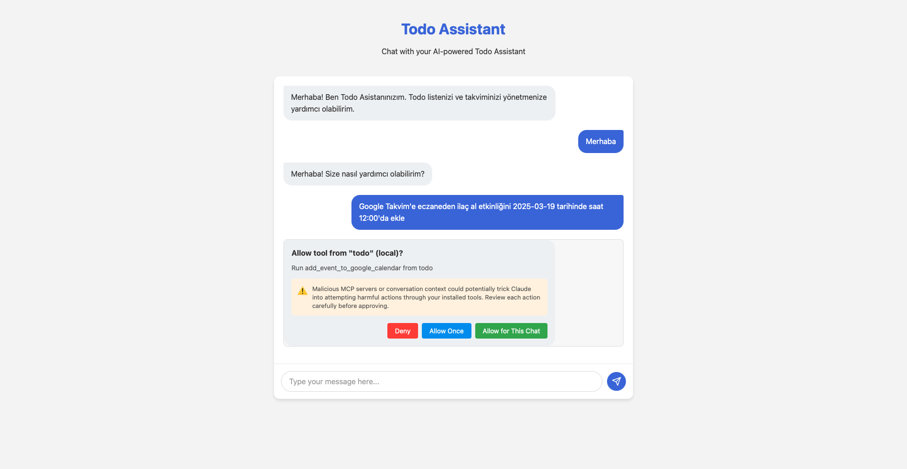

# Todo Assistant with AI and Google Calendar Integration

A modern, AI-powered todo list and calendar management application that combines OpenAI's Assistant API with Google Calendar integration. Built with TypeScript and featuring both MCP (Model Context Protocol) and traditional API endpoints.

<p align="center">
  
  <br>
  <em>Todo Assistant Main Screen</em>
</p>

## 🌟 Key Features

- **AI-Powered Chat Interface**: Natural language interaction using OpenAI's GPT-3.5 Turbo
- **Smart Todo Management**: Add, remove, list, and toggle todos using natural language
- **Google Calendar Integration**: Seamlessly sync todos with Google Calendar
- **Multi-Language Support**: Full support for English and Turkish
- **Tool Approval System**: Secure approval workflow for sensitive operations
- **MCP (Model Context Protocol)**: Standardized AI tool interactions
- **Responsive Design**: Modern, mobile-friendly web interface
- **Persistent Storage**: SQLite database for reliable data management

## 🛠️ Technical Stack

- **Backend**:
  - Node.js with Express
  - TypeScript
  - SQLite (via better-sqlite3)
  - OpenAI Assistant API
  - Google Calendar API

- **Frontend**:
  - HTML5 & CSS3
  - Modern JavaScript
  - Responsive Design

- **AI & Integration**:
  - OpenAI GPT-3.5 Turbo
  - Model Context Protocol (MCP)
  - OAuth 2.0 for Google Calendar

## 📋 Prerequisites

- Node.js (v16 or higher)
- npm or yarn
- OpenAI API key
- Google Cloud Console account
- SQLite

## 🚀 Getting Started

1. **Clone the Repository**
   ```bash
   git clone https://github.com/yourusername/todo-assistant.git
   cd todo-assistant
   ```

2. **Install Dependencies**
   ```bash
   npm install
   ```

3. **Environment Setup**
   Create a `.env` file in the root directory:
   ```env
   OPENAI_API_KEY=your_openai_api_key
   PORT=3000
   CLIENT_ID=your_google_client_id
   CLIENT_SECRET=your_google_client_secret
   GOOGLE_REDIRECT_URI=http://localhost:3000/google/callback
   ```

4. **Build and Run**
   ```bash
   # Build TypeScript
   npm run build

   # Start server
   npm start

   # Development mode with auto-reload
   npm run dev

   # Start with MCP enabled
   npm run dev:mcp
   ```

## 🗄️ Database Structure

### Todos Table
```sql
CREATE TABLE todos (
    id INTEGER PRIMARY KEY AUTOINCREMENT,
    text TEXT NOT NULL,
    completed BOOLEAN NOT NULL DEFAULT 0,
    createdAt TEXT NOT NULL
)
```

### Calendar Events Table
```sql
CREATE TABLE calendar_events (
    id INTEGER PRIMARY KEY AUTOINCREMENT,
    todoId INTEGER NOT NULL,
    title TEXT NOT NULL,
    date TEXT NOT NULL,
    time TEXT NOT NULL,
    createdAt TEXT NOT NULL,
    FOREIGN KEY (todoId) REFERENCES todos(id) ON DELETE CASCADE
)
```

## 🔌 API Endpoints

### Traditional REST API
- `POST /api/thread` - Create/get user thread
- `POST /api/chat` - Send/receive messages
- `GET /api/history/:userId` - Get chat history
- `POST /api/tool-response` - Handle tool approvals

### MCP Endpoints
- `POST /mcp` - Main MCP interaction endpoint
- `GET /mcp/health` - Health check
- `GET /mcp/tools` - Available tools listing

## 💡 Usage Examples

### English Commands
```
"Add 'Buy groceries' to my todo list"
"Show all my todos"
"Mark todo #3 as complete"
"Add 'Team meeting' to calendar for tomorrow at 2pm"
"Show my calendar events for next week"
```

### Turkish Commands
```
"Alışveriş yapmayı listeye ekle"
"Tüm görevlerimi göster"
"3 numaralı görevi tamamlandı olarak işaretle"
"Yarın saat 14:00'da takım toplantısını takvime ekle"
"Gelecek haftaki takvim etkinliklerimi göster"
```

## 🔒 Security Features

- Tool approval workflow for sensitive operations
- OAuth 2.0 authentication for Google Calendar
- Secure credential management
- Input validation and sanitization

## 🌐 Google Calendar Setup

1. Go to [Google Cloud Console](https://console.cloud.google.com/)
2. Create a new project or select existing
3. Enable Google Calendar API
4. Configure OAuth 2.0 credentials:
   - Set application type as "Web application"
   - Add authorized redirect URI: `http://localhost:3000/google/callback`
   - Download credentials and update `.env` file

## 🤝 Contributing

1. Fork the repository
2. Create your feature branch (`git checkout -b feature/AmazingFeature`)
3. Commit your changes (`git commit -m 'Add some AmazingFeature'`)
4. Push to the branch (`git push origin feature/AmazingFeature`)
5. Open a Pull Request

## 📝 License

This project is licensed under the MIT License - see the [LICENSE](LICENSE) file for details.

## 🙏 Acknowledgments

- OpenAI for their powerful Assistant API
- Google Calendar API team
- Contributors and testers

## 📞 Support

For support, please open an issue in the GitHub repository or contact the maintainers. 
