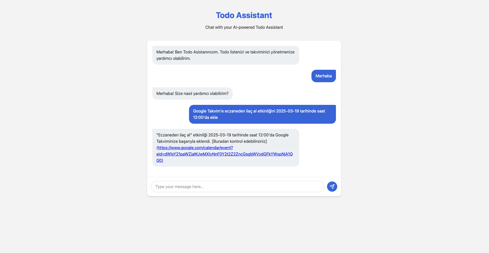
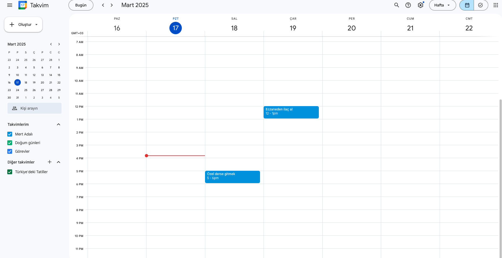

# OpenAI Todo Assistant Server

A full-stack application that uses OpenAI's Assistant API to manage a todo list with Google Calendar integration. The application includes a Node.js Express server backend and a responsive web frontend.


<p align="center">
  
  <br>
  <em>Todo Assistant Main screen</em>
</p>

<p align="center">
  
  <br>
  <em>Tool approval screen </em>
</p>

<p align="center">
  
  <br>
  <em>Google calendar screen </em>
</p>


## Features

- Chat-based interface to manage your todo list
- Powered by OpenAI's GPT-4o Assistant API
- Google Calendar integration for scheduling todos
- SQLite database for persistent storage
- Responsive web interface
- Support for adding, removing, listing, and toggling todo items
- Tool approval workflow for sensitive operations
- Multi-language support (English and Turkish)

## Technical Stack

- **Backend**: Node.js with Express
- **Frontend**: HTML, CSS, JavaScript
- **Database**: SQLite (via better-sqlite3)
- **AI**: OpenAI Assistant API with GPT-4o model
- **Calendar**: Google Calendar API
- **Language**: TypeScript

## Setup

1. Clone this repository
2. Install dependencies:
   ```
   npm install
   ```
3. Create a `.env` file in the root directory with your OpenAI API key:
   ```
   OPENAI_API_KEY=your_openai_api_key_here
   ```
4. Replace `your_openai_api_key_here` with your actual OpenAI API key
5. For Google Calendar integration, you'll need to set up OAuth 2.0 credentials:
   - Go to the [Google Cloud Console](https://console.cloud.google.com/)
   - Create a new project or select an existing one
   - Enable the Google Calendar API
   - Create OAuth 2.0 credentials (Web application type)
   - Add `http://localhost:3000/oauth2callback` as an authorized redirect URI
   - Download the credentials JSON file

## Running the server

1. Build the TypeScript code:
   ```
   npm run build
   ```
2. Start the server:
   ```
   npm start
   ```
3. For development with auto-reloading:
   ```
   npm run dev
   ```

The server will be available at http://localhost:3000.

## Database

The application uses SQLite to store todo items and calendar events. The database file is created at `~/openai-todos/todos.db` and includes the following tables:

### Todos Table
- `id`: Unique identifier for each todo item
- `text`: The content of the todo item
- `completed`: Boolean flag indicating completion status
- `createdAt`: Timestamp when the todo was created

### Calendar Events Table
- `id`: Unique identifier for each calendar event
- `todoId`: Foreign key referencing the associated todo item
- `title`: The title of the calendar event
- `date`: The date of the event
- `time`: The time of the event
- `createdAt`: Timestamp when the event was created

## API Endpoints

- `POST /api/thread` - Create or get a thread for a user
- `POST /api/chat` - Send a message and get a response
- `GET /api/history/:userId` - Get chat history for a user
- `POST /api/tool-response` - Handle tool approval or denial

## Available Tools

The assistant has access to the following tools:

### Todo Management
- `add_todo` - Add a new item to the todo list
- `get_todos` - Get all items from the todo list
- `remove_todo` - Remove an item from the todo list by ID
- `toggle_todo` - Toggle the completion status of a todo item
- `remove_all_todos` - Remove all todos from the list

### Calendar Management
- `add_todo_to_calendar` - Add a todo to the local calendar
- `get_calendar_events` - Get events from the local calendar
- `add_todo_to_google_calendar` - Add a todo to Google Calendar
- `get_google_calendar_events` - Get events from Google Calendar
- `setup_google_calendar` - Set up Google Calendar integration
- `authenticate_google_calendar` - Authenticate with Google Calendar
- `check_google_calendar_auth` - Check Google Calendar authentication status
- `add_event_to_google_calendar` - Add an event to Google Calendar

## Usage Examples

You can interact with the assistant using natural language in English or Turkish. Here are some examples:

### English
- "Add 'Buy groceries' to my todo list"
- "Show me all my todos"
- "Mark todo #3 as complete"
- "Remove todo #2 from my list"
- "What's on my todo list?"
- "Add 'Team meeting' to my calendar on March 15 at 2pm"
- "Show my calendar events for tomorrow"
- "Set up Google Calendar integration"

### Turkish
- "Alışveriş yapmak görevini ekle"
- "Tüm görevlerimi göster"
- "3 numaralı görevi tamamlandı olarak işaretle"
- "2 numaralı görevi listeden kaldır"
- "Görev listemde neler var?"
- "15 Mart saat 14:00'da 'Takım toplantısı' etkinliğini takvime ekle"
- "Yarınki takvim etkinliklerimi göster"
- "Google Takvim entegrasyonunu kur"

## Türkçe Açıklama

Bu uygulama, OpenAI'nin Asistan API'sini kullanarak yapılacaklar listesi yönetimi ve Google Takvim entegrasyonu sağlayan tam yığın bir uygulamadır. Node.js Express sunucu arka ucu ve duyarlı bir web ön ucu içerir.

### Özellikler
- Yapılacaklar listenizi yönetmek için sohbet tabanlı arayüz
- OpenAI'nin GPT-4o Asistan API'si ile güçlendirilmiş
- Google Takvim entegrasyonu
- Kalıcı depolama için SQLite veritabanı
- Duyarlı web arayüzü
- Görev ekleme, kaldırma, listeleme ve durumunu değiştirme desteği
- Hassas işlemler için araç onay iş akışı
- Çoklu dil desteği (İngilizce ve Türkçe)

## License

MIT 
